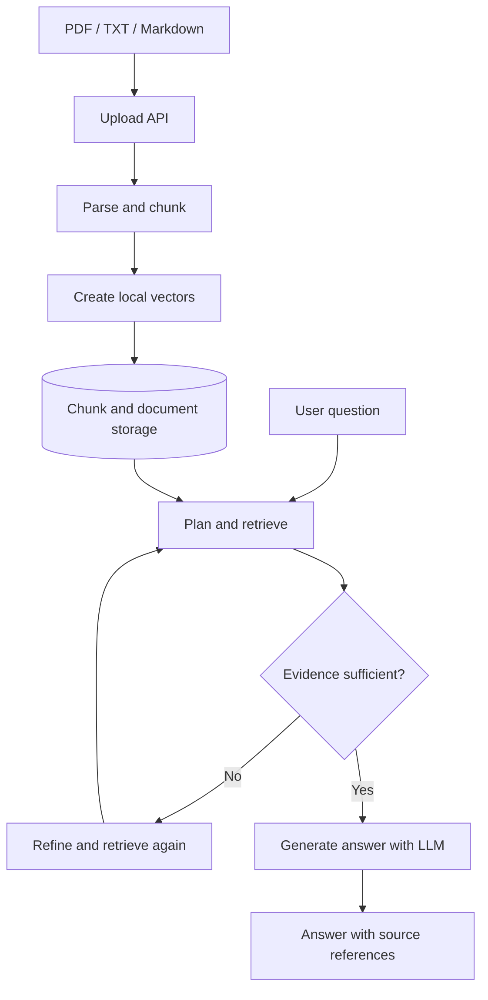

# Multi-Document Research Assistant

A document research workspace built with **Next.js, React, TypeScript, LangChain.js, Groq-hosted Llama models, and optional Upstash Redis persistence**. Upload PDFs, text files, or Markdown documents, ask questions across them, and inspect source references.

> **Project status:** Personal engineering project / portfolio prototype. It demonstrates an AI application architecture; it is not presented as a production-audited or security-certified service.


## New here? Start with the learning guides

- **[Beginner guide: understand and run the project](docs/START_HERE.md)** — plain-English explanations, setup steps, code map, vocabulary, and a learning plan.
- **[Interview notes](docs/INTERVIEW_NOTES.md)** — concise explanations, likely questions, trade-offs, and practice checklist.
- **[Portfolio learning roadmap](docs/PORTFOLIO_LEARNING_ROADMAP.md)** — how the two projects fit together, Git/GitHub basics, and a 10-day study plan.
- [Architecture and engineering notes](docs/architecture.md) — design decisions and limitations.

## Why this project exists

A basic chatbot can answer from general model knowledge and make unsupported claims. A document research assistant should retrieve evidence from the user's own material and make it possible to inspect where an answer came from.

This project explores document ingestion, chunking, retrieval, evidence evaluation, query refinement, synthesis, and source citations.

## Features

- Ingestion for PDF, TXT, and Markdown files.
- Text chunking with source metadata where available.
- Retrieval workflow with similarity scoring and options intended to improve relevance and document coverage.
- Iterative retrieval when the first evidence set appears weak.
- Source-linked answers and a streaming chat interface with progress updates.
- Optional persistent storage when the required Upstash configuration is supplied; otherwise, some state is kept in memory.

## Architecture at a glance



## Technology

| Area | Tools |
|---|---|
| Web application | Next.js App Router, React, TypeScript |
| Styling and interaction | Tailwind CSS, Framer Motion, Lucide |
| AI workflow | LangChain.js and custom orchestration |
| Chat model provider | Groq-hosted Llama models |
| Embedding representation | Local deterministic token-hashing vectors (a prototype approach, not a modern semantic embedding service) |
| Document processing | PDF parsing, text splitting, Markdown rendering |
| Persistence | Optional Upstash Redis; in-memory paths are temporary |
| CI | GitHub Actions: lint, TypeScript check, and production build |

## Run locally

### Requirements

- Node.js 22 (the version used by CI)
- npm
- A Groq API key
- Optional: Upstash Redis for persistence

### Setup

```bash
git clone https://github.com/IamAlag/research-assistant.git
cd research-assistant
npm ci --legacy-peer-deps
```

Create a `.env.local` file in the project root:

```dotenv
GROQ_API_KEY=replace-with-your-key
GROQ_CHAT_MODEL=llama-3.3-70b-versatile
```

Never commit real API keys, tokens, or database credentials. If using Upstash Redis, configure the environment variables read by the storage implementation.

Start the development server:

```bash
npm run dev
```

Open [http://localhost:3000](http://localhost:3000).

Useful checks:

```bash
npm run lint
npx tsc --noEmit
npm run build
```

## Repository map

```text
src/app/api/upload/          # Upload and ingest documents
src/app/api/chat/            # Chat request and streamed response
src/app/api/documents/       # Document catalogue operations
src/components/chat/         # Chat UI, messages, citations
src/components/documents/    # Upload UI and document list
src/lib/services/            # Orchestration, retrieval, model, storage, embeddings
src/lib/prompts/             # Instructions for workflow stages
src/lib/config.ts            # Environment variables and defaults
.github/workflows/ci.yml     # Automated validation
docs/START_HERE.md           # Beginner-friendly learning guide
docs/INTERVIEW_NOTES.md      # Interview preparation
docs/architecture.md         # Architecture and trade-offs
```

## Engineering trade-offs and limitations

- **Vector quality is a known limitation.** The current embedding service hashes tokens into numeric vectors locally. This is deterministic and avoids another API dependency, but it is not equivalent to a modern semantic embedding model and may miss synonyms or related concepts.
- **Retrieval is not proof of correctness.** Relevant passages can be missed, and a model can misinterpret retrieved evidence.
- **Citations must be verified.** Source references improve inspectability but do not guarantee every claim is supported.
- **In-memory mode is temporary.** Data may be lost between restarts or serverless instances.
- **Uploaded files are untrusted input.** Do not upload confidential material to an unreviewed deployment. Before production use, validate upload limits and content types, add abuse controls and observability, and conduct a security review.
- **Evaluation is ongoing.** A useful benchmark should measure retrieval quality, citation support, answer correctness, latency, and provider cost on a documented question set.

## Next improvements

- Compare local token-hashing vectors with a real semantic embedding model using a labelled question set.
- Add tests for parsing, retrieval, citation support, and API error paths.
- Measure latency and model cost rather than guessing.
- Harden upload validation and add rate limiting before exposing the app to untrusted users.

## About

Built by [Alagappan](https://github.com/IamAlag) as a hands-on project exploring grounded LLM applications and full-stack AI engineering. Feedback and issue reports are welcome.
