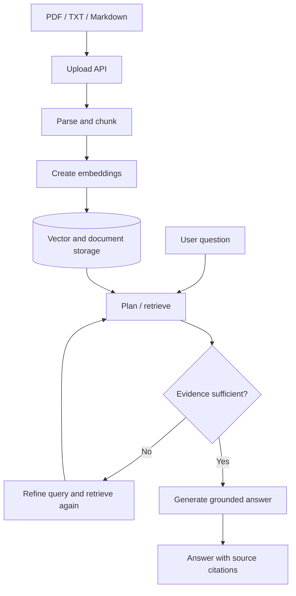

# Multi-Document Research Assistant

A document-grounded research workspace built with **Next.js, TypeScript, LangChain.js, Google Gemini, and optional Upstash Redis persistence**. Upload a collection of PDFs, text files, or Markdown documents, ask a question across them, and inspect the sources used to form an answer.

> **Project status:** Personal engineering project / portfolio prototype. It demonstrates an AI application architecture; it is not presented as a production-audited or security-certified service.


## Why this project exists

A basic chatbot answers from model knowledge and can make unsupported claims. A document research assistant should retrieve relevant evidence from the user's own material and make it possible to check where an answer came from.

This project explores that workflow: document ingestion, chunking, semantic retrieval, evidence evaluation, query refinement, synthesis, and source citations.

## Features

- **Multi-document ingestion** for PDF, TXT, and Markdown files.
- **Structure-aware chunking** intended to preserve useful section context and provenance.
- **Semantic retrieval** with cosine similarity, Maximal Marginal Relevance (MMR), and metadata filtering.
- **Iterative retrieval workflow** that can refine a search when the first evidence set appears weak.
- **Source-linked answers** with document/page or section information where available.
- **Streaming chat UI** and a visible progress panel for workflow stages.
- **Optional Redis persistence** for document metadata and vector entries when the required Upstash configuration is supplied; otherwise the application falls back to in-memory storage.

## Architecture at a glance



See [docs/architecture.md](docs/architecture.md) for the component map, key trade-offs, and current limitations.

## Technology

| Area | Tools |
|---|---|
| Web application | Next.js App Router, React, TypeScript |
| Styling and interaction | Tailwind CSS, Framer Motion, Lucide |
| AI orchestration | LangChain.js and a custom retrieval workflow |
| Models | Google Gemini chat and embedding models |
| Document processing | PDF parsing, text splitting, Markdown rendering |
| Persistence | Upstash Redis when configured; in-memory fallback |
| Deployment target | Vercel-compatible Next.js application |

## Run locally

### Requirements

- Node.js 20 or newer
- npm
- A Google AI Studio API key
- Optional: an Upstash Redis database for persistence across serverless instances

### Setup

```bash
git clone https://github.com/IamAlag/research-assistant.git
cd research-assistant
npm install --legacy-peer-deps
```

Create a `.env.local` file in the project root:

```dotenv
GOOGLE_API_KEY=replace-with-your-key
```

If using Upstash Redis, configure the Redis environment variables expected by the application. Do not commit real API keys, tokens, or database credentials.

Start the development server:

```bash
npm run dev
```

Open [http://localhost:3000](http://localhost:3000).

Other available scripts:

```bash
npm run lint
npm run build
npm run start
```

## Repository map

```text
src/
├── app/
│   └── api/
│       ├── chat/        # Chat and streaming response endpoint
│       ├── documents/   # Document catalog operations
│       └── upload/      # Ingestion and indexing
├── components/          # Chat, documents, shared UI, progress panel
├── lib/
│   ├── prompts/         # Stage-specific model instructions
│   ├── services/        # Ingestion, retrieval, persistence, orchestration
│   └── utils/           # Validation and helper functions
└── types/               # Shared TypeScript types
```

## Engineering trade-offs and limitations

- **Retrieval is not proof of correctness.** Relevant passages can be missed, and a model can still misinterpret retrieved evidence.
- **Citations must be verified.** Source links and excerpts improve inspectability but do not guarantee every claim is supported.
- **In-memory mode is temporary.** Data may be lost between serverless instances or restarts. Configure persistent storage for a stable demo.
- **Model access has cost and latency.** Requests depend on provider availability, rate limits, and model behaviour.
- **Uploaded files are untrusted input.** Do not upload confidential material to a public deployment. Before production use, add and validate strict upload limits, robust content-type checks, abuse controls, observability, and a security review.
- **Evaluation is ongoing.** A proper benchmark should measure retrieval quality, citation support, answer correctness, latency, and token/cost usage on a documented question set.

## Next improvements

- Add a versioned evaluation set with expected source passages.
- Add unit and integration tests for parsing, retrieval, citations, and API error paths.
- Add automated type-checking and CI build verification.
- Record latency and token usage to make quality/cost trade-offs measurable.
- Harden upload validation and add rate limiting before exposing the app to untrusted users.

## About

Built by [Alagappan](https://github.com/IamAlag) as a hands-on project exploring grounded LLM applications and full-stack AI engineering. Feedback and issue reports are welcome.
